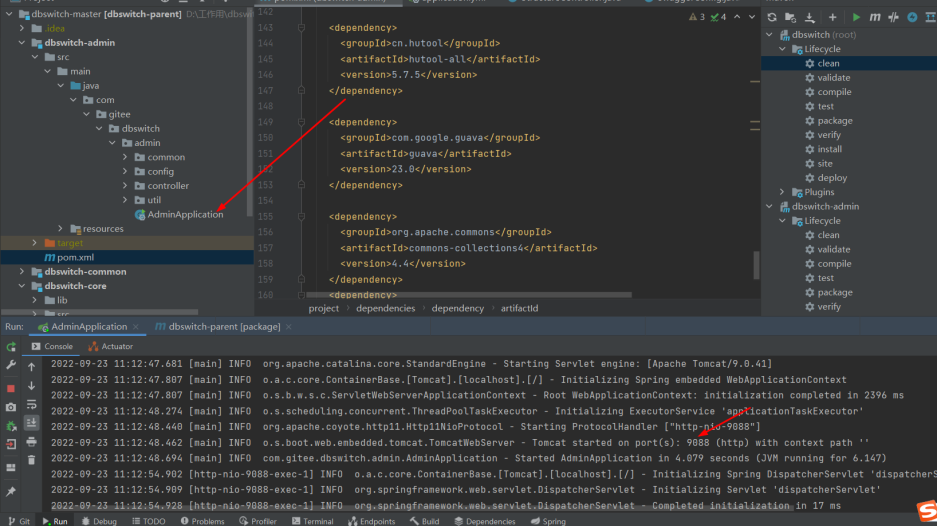

# 不同数据库DDL语句生成工具

## 一、工具介绍

### 1、功能描述

输入源表连接信息、表名，和目标数据库类型、库表，自动生成目标库的DDL语句


### 2、详细功能

- 源端oracle/SqlServer/MySQL/PostgreSQL
 
- 目的端oracle/SqlServer/MySQL/PostgreSQL

### 3、结构设计
  
  
- 模块结构功能 

```
└── dbswitch
    ├── dbswitch-common    // dbswitch通用定义模块
    ├── dbswitch-core      // 数据库元数据抽取与建表结构语句转换模块
    ├── dbswitch-admin     // 在以上模块的基础上引入Quartz的调度服务与接口
```
 
## 二、运行

本工具纯Java语言开发，代码中的依赖全部来自于开源项目。

### 1、环境要求

  **JDK**:>=1.8 （建议用JDK 1.8）
 
  **maven**:>=3.6
> Maven 仓库默认在国外， 国内使用难免很慢，可以更换为阿里云的仓库。 参考教程： [配置阿里云的仓库教程](https://www.runoob.com/maven/maven-repositories.html)


### 2、部署

(1) 运行dbswitch-admin下的AdminApplication


## 三、远程使用
### 1、接口文档

地址：172.16.5.165:8080/swagger-ui/


### 1、生成单张表

#### (1)配置文件

```
{
"type":"oracle",
"host":"172.16.5.162",
"port":1521,
"mode":"sid",
"user":"system",
"passwd":"system",
"dbname":"helowin",
"charset":"utf-8",
"src_model":"TEST",
"src_table":"student",
"target":"sqlserver",
"dest_model":"ljh_test",
"dest_table":"ods_student"
}
```

#### (2)调用

POST 172.16.5.165:8080/dbswitch/admin/api/v1/database/table_sql

#### （3）返回结果

```
    CREATE TABLE   [ljh_test
].[ods_student
] (
           [sid
]  BIGINT,
[sname
]  VARCHAR(510),
[entrance_date
]  DATETIME,
[credit
]  DECIMAL(5,
2),
[sex
]  VARCHAR(10),
[is_delete
]  DECIMAL(38,
0),
[update_time
]  DATETIME,
        PRIMARY KEY ([sid
])
    )
```

### 1、生成多张表

#### (1)配置文件

```
{
"type":"oracle",
"host":"172.16.5.162",
"port":1521,
"mode":"sid",
"user":"system",
"passwd":"system",
"dbname":"helowin",
"charset":"utf-8",
"src_model":"TEST",
"multi_src_table":"student,ABANK",
"target":"oracle",
"dest_model":"ljh_test",
"dest_table_prefix":"ods_"
}
```

#### (2)调用

POST 172.16.5.165:8080/dbswitch/admin/api/v1/database/multi_table_sql_by_union_prefix

#### （3）返回结果

```
        CREATE TABLE  "ljh_test"."ods_student" (
           "sid"    NUMBER,
"sname"    NVARCHAR2(255),
"entrance_date"    TIMESTAMP,
"credit"    NUMBER(5,
2),
"sex"    NVARCHAR2(5),
"is_delete"    INTEGER,
"update_time"    TIMESTAMP,
        PRIMARY KEY ("sid")
    );
    CREATE TABLE  "ljh_test"."ods_ABANK" (
           "UPDTICK_0"    NUMBER,
"CRY_0"    NVARCHAR2(3),
"BAN_0"    NVARCHAR2(20),
"PAB_0"    NVARCHAR2(35),
"BIC_0"    NVARCHAR2(11),
"PORBANCOD_0"    NVARCHAR2(10),
"VLYSTR_0"    TIMESTAMP,
"VLYEND_0"    TIMESTAMP,
"CREDAT_0"    TIMESTAMP,
"CREUSR_0"    NVARCHAR2(5),
"UPDDAT_0"    TIMESTAMP,
"UPDUSR_0"    NVARCHAR2(5),
"CREDATTIM_0"    TIMESTAMP,
"UPDDATTIM_0"    TIMESTAMP,
"AUUID_0"    BLOB
    );

```

## 五、其他要点

### 1、报错

> 解决办法：确定数据源信息正确，提交的内容无误。

### 2、各种数据库的写法
#### postgresql
```
{
"type":"postgresql",
"host":"172.16.5.66",
"port":5432,
"mode":"",
"user":"postgres",
"passwd":"Zzh!@7465671",
"dbname":"bigdata",
"charset":"utf-8",
"src_model":"wxf_test",
"src_table":"ABANK",
"target":"oracle",
"dest_model":"ljh_test",
"dest_table":"ods_student"
}
```
#### oracle
```
{
"type":"oracle",
"host":"172.16.5.162",
"port":1521,
"mode":"sid",
"user":"system",
"passwd":"system",
"dbname":"helowin",
"charset":"utf-8",
"src_model":"TEST",
"multi_src_table":"student,ABANK",
"target":"oracle",
"dest_model":"ljh_test",
"dest_table_prefix":"ods_"
}
```
#### mysql
```
{
"type":"mysql",
"host":"172.16.5.162",
"port":3306,
"mode":"",
"user":"root",
"passwd":"boulderai123",
"dbname":"mysql",
"charset":"utf-8",
"src_model":"mysql",
"src_table":"db",
"target":"oracle",
"dest_model":"ljh_test",
"dest_table":"ods_student"
}

```
#### sqlserver
```
{
"type":"sqlserver",
"host":"LIUJINHUI",
"port":1433,
"mode":"",
"user":"sa",
"passwd":"boulderai123",
"dbname":"data_test",
"charset":"utf-8",
"src_model":"dbo",
"src_table":"ICBOM",
"target":"oracle",
"dest_model":"ljh_test",
"dest_table":"ods_student"
}
```


## 七、问题反馈

如果您看到并使用了本工具，或您觉得本工具对您有价值，请为此项目**点个赞**，以表示对本项目的支持，多谢！如果您在使用时遇到了bug，欢迎call me：刘金辉


